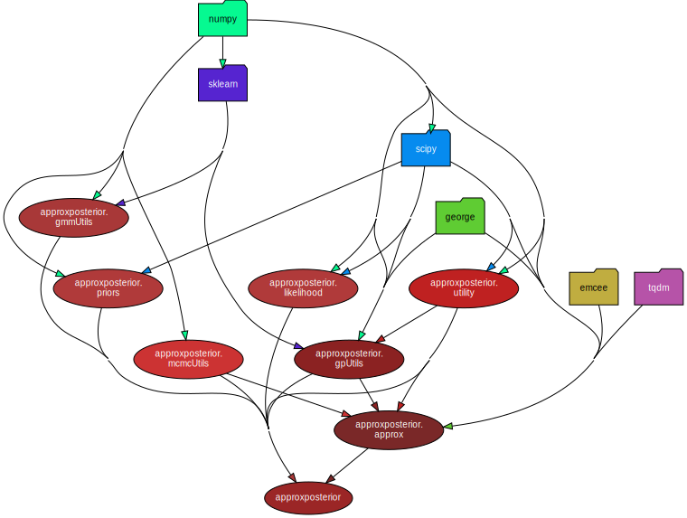
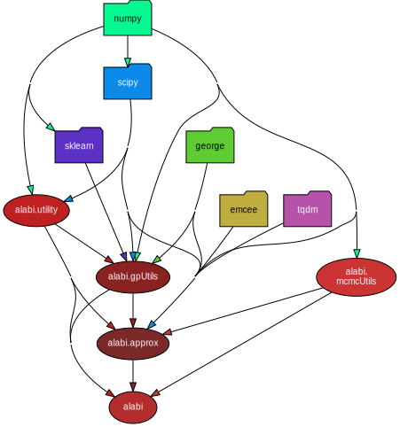

# approxposterior

### Directory structure:



```
[K] = keep module
[C] = change module
[M] = move functionality to different module or rename
[R] = remove module
[A] = add new module

(0) = not started
(1) = started
(2) = completed implementation
(3) = completed, tested, and working
(4) = completed documenting and commenting
```
```
__init__.py                 [C] (0) remove deprecated imports 

core.py
    SurrogateModel     
        __init__            [C] (1) get rid of inputs: lnlike, lnprior, priorSample 
                                    add input: fn (fn=lnposterior or fn=lnlike)
                                (1) add cache option, which will pickle SM obj (every iteration?)
        evaluate                    (previously _gpll)
                            [C] (2) remove prior   
        opt_gp              [K]     calls gpUtils.optimizeGP; might need to tweak inputs
        run                 [R]     replace with 'active_sample' function
        init_train          [A] (0) compute initial training samples (theta0, y0)
                                (0) default options for: priorSample
                                (0) parallelize
                                (0) option to load theta0, y0
        init_test           [A] (0) compute test samples (theta_test, y_test) to evaluate GP error
        active_train        [A] (0) call 'findNextPoint' for specified niter
                                (0) store hyperparameters for each iteration to array
        find_next_point     [C] (0) think this is mostly what I want; change some variable names
        run_mcmc            [C] (0) add option for choosing MCMC package
        find_map            [K]
        bayes_opt           [C] (0) remove old convergence criteria; add new cc from gpUtils
        plot                [A] (0) call functions from visualization.py 

    loadModel               [A] (0) load pickled model and print summary

gpUtils.py
    defaultHyperPrior       [K] 
    defaultGP               [K]
    optimizeGP              [C] (0) parallelize
    convergenceCheck        [A] (0) implement convergence criteria (tbd)
    hyperCubeSample         [A] (0) sampling methods (uniform, grid, sobol)

mcmc.py                     [A] (0) wrapper for mcmc samplers 
    Sampler

mcmcUtils/
    emceeUtils.py                   (previously mcmcUtils.py)
        validateMCMCKwargs  [K]
        batchMeansMCSE      [K]
        estimateBurnin      [K]

    dynestyUtils.py         [A] (0)

utility.py  
    logsubexp               [K]
    AGPUtility              [K]
    BAPEUtility             [K]
    JonesUtility            [K]
    minimizeObjective       [K]
    klNumerical             [R]

likelihood.py               [M] (0) rename to benchmarks.py; add more benchmark functions
    rosenbrockLnlike
    rosenbrockLnprior
    rosenbrockSample
    rosenbrockLnprob
    ... 
```
```
bayes.py                    [A] (0) utilities for constructing common likelihood/prior fns
                                include prior transform function

defaults.py                 [A] (0) define default settings and import to other files?

visualization.py            [A] (0) import into approx.py
    cornerLnP               [A] (0)
    cornerDensity           [A] (0)
    iterationLnP            [A] (0)
```
```
priors.py                   [R]     not implemented functions

gmmUtils.py                 [R]     used for Wang & Li convergence method (deprecated)
    fitGMM                  [R]
```


# alabi

<!-- ### Directory structure:
 -->

